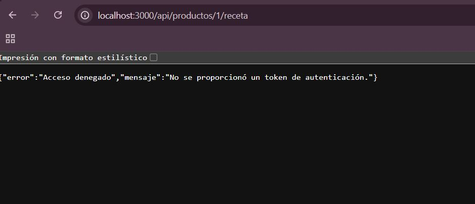

# REPORTE DE EVIDENCIAS DE PRUEBAS — ACT-9 (API Y SEGURIDAD)

**Proyecto:** A La Burger OS  
**QA Tester:** Jarumi Guadalupe Flores  
**Fecha:** 19 de Julio de 2026  
**Estado:** En Progreso (Validaciones Parciales por Bloqueo de Deploy)

---

## 1. CONTROL DE AUTENTICACIÓN Y SEGURIDAD (MIDDLEWARES)
*En esta sección se documenta el comportamiento de las rutas protegidas ante la presencia y ausencia de credenciales válidas.*

### 1.1 Prueba SIN Token de Autenticación (Caso Fallido Esperado)
* **Endpoint consultado:** `GET localhost:3000/api/productos/1/receta`
* **Descripción:** Se intenta acceder directamente a una ruta protegida desde el navegador sin enviar las cabeceras ni el token correspondientes.
* **Resultado:** El backend responde correctamente rechazando la petición por seguridad con un estado `403 Forbidden` / `401 Unauthorized`.
* **Evidencia:**  
  

### 1.2 Prueba CON Token de Autenticación (Caso Exitoso)
* **Endpoint consultado:** `GET /api/auth/login` y rutas protegidas.
* **Descripción:** Validación del flujo una vez que el token es inyectado en las cabeceras (`Headers -> Authorization`).
* **Estado actual:** **[PENDIENTE]** Esta prueba se completará en cuanto se restablezca el entorno del frontend/deploy para capturar el almacenamiento del token.

---

## 2. INTEGRACIÓN Y FUNCIONAMIENTO DE ENDPOINTS (BACKEND)
*Validación del correcto mapeo y respuesta de los endpoints desarrollados para la Épica 18.*

### 2.1 Módulo de Productos y Recetas (HU-17 / HU-13)
* **Endpoint documentado:** `GET /api/productos/:id/ingredientes`
* **Estado actual:** **[BLOQUEADO]** 
* **Descripción del hallazgo:** Durante la inspección del código local en el archivo `productRoutes.js`, se detectó una discrepancia crítica de nomenclatura. El backend tiene registrada la ruta como `/:id/receta`, mientras que el frontend y las tarjetas de ClickUp solicitan la palabra `/:id/ingredientes`. 
* **Acción correctiva en curso:** El desarrollador (Alexis) confirmó tener la corrección lista en su entorno local. Las capturas de pantalla con las respuestas correctas (`200 OK`, manejo de ID inexistente `404` y arrays vacíos) se anexarán a esta sección en cuanto se autorice el *merge* de las ramas y se estabilice el deploy general.

---

## 3. INTEGRACIÓN DE API EXTERNA
*Evidencias del correcto consumo y comunicación con los servicios externos del sistema.*

* **Descripción del servicio:** Servicio de integración con la API externa del **KDS (Kitchen Display System / Sistema de Pantallas de Cocina)**. Su función principal es comunicar en tiempo real los ingredientes y recetas de los productos hacia la interfaz de la cocina para la preparación de los pedidos.
* **Estado actual:** **[PENDIENTE]**
* **Detalle:** Las pruebas de consumo y comunicación con este servicio externo se encuentran pausadas temporalmente. Debido a que el flujo de productos y recetas está congelado en el backend por el conflicto de ramas, no es posible enviar cargas de datos (*payloads*) de prueba hacia la API del KDS. Las capturas de las peticiones salientes y sus respuestas se integrarán en cuanto se libere el entorno.